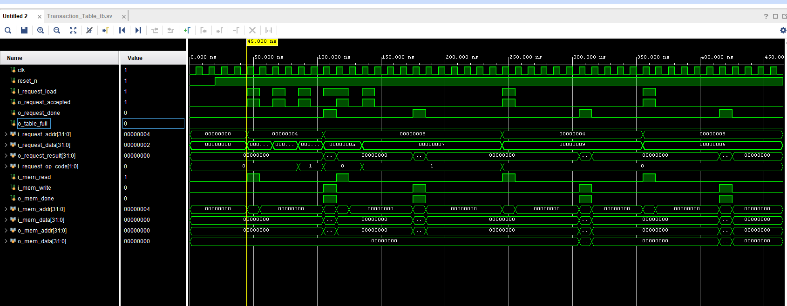
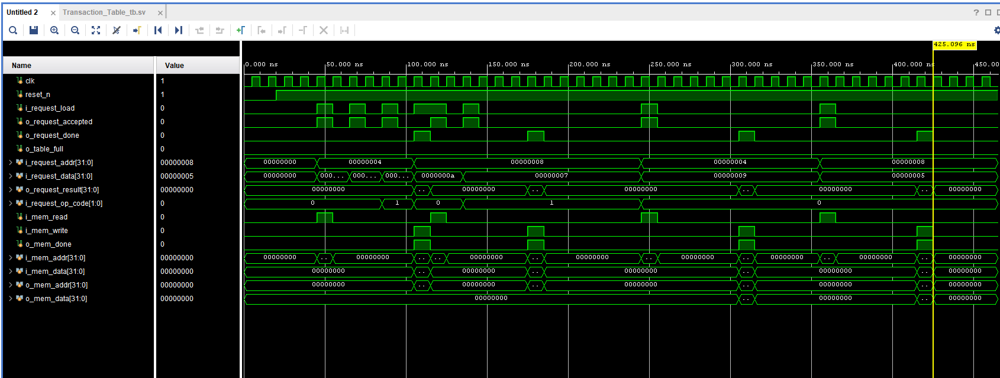
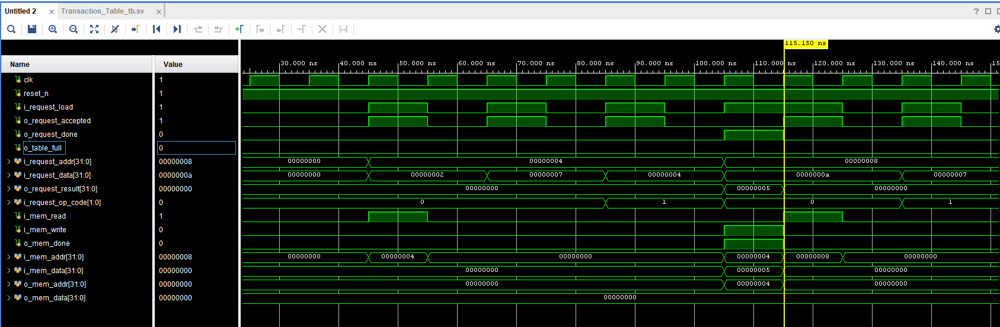

# Pipelined ALU with Transaction Table Aggregation

## Project Overview

This project tackles a major performance killer in high speed FPGA network acceleration: **external memory latency**. When you're dealing with huge flow tables or counters (like in 100 Gb/s monitoring), you have to rely on external memory, which is slow.

Standard processing pipelines frequently stall because updating a counter requires a Read-Modify-Write (RMW) sequence; if multiple requests hit the same address, the whole system waits, increasing latency significantly, a huge bottleneck. Also, traditional caches don't work well here because network traffic has very low locality.

My solution, implemented in **SystemVerilog**, is based on a novel architecture that uses a specialized **Transaction Table** to aggregate operations, exploiting mathematical associativity instead of locality.

## Key Features & Innovations

* **Latency Mitigation:** Successfully masks the high latency of external memory accesses for associative operations like counter updates.
* **Transaction Table Core:** A local table stores partial sums from multiple updates targeting the same address (e.g., $M_{new} = M_{old} + (u1 + u2 + u3)$), this is crucial.
* **Non-Blocking Operation:** If a new request matches an address already in the Transaction Table, the ALU accepts the request immediately and aggregates the value locally, without waiting for the slow external memory transaction to finish.
* **Reduced Memory Traffic:** The system only interacts with the external memory when a new entry is created or evicted, not for every single operation, this eliminates redundant RMW cycles.
* **SystemVerilog Simulation Environment:** I built a complete environment including a configurable **Mock External Memory** to accurately simulate real-world latency and the request/acknowledge handshake protocol.

## Performance Results (Simulation)

I simulated both a **Standard ALU (baseline)** and the **Proposed ALU** under a high-collision workload (6 consecutive operations targeting the same addresses). The results quantify the major speedup provided by the Transaction Table architecture:

| Metric | Standard ALU | Proposed ALU | Improvement |
| :--- | :--- | :--- | :--- |
| **Total Active Time** | 690 ns | 380 ns | **44.93% Reduction** |
| **Speedup Factor ($S_p$)** | 1.0x | 1.81x | **1.81x Speedup** |

This 1.81x speedup directly confirms that for workloads where flow collisions are frequent; the Transaction Table is way better than just pipelining or using traditional caching techniques.

## Simulation Waveforms

Below is the waveform showing how the Proposed ALU accepts multiple requests even while the memory interface is busy, this is proof of the non-blocking aggregation logic.

Sequence detail

